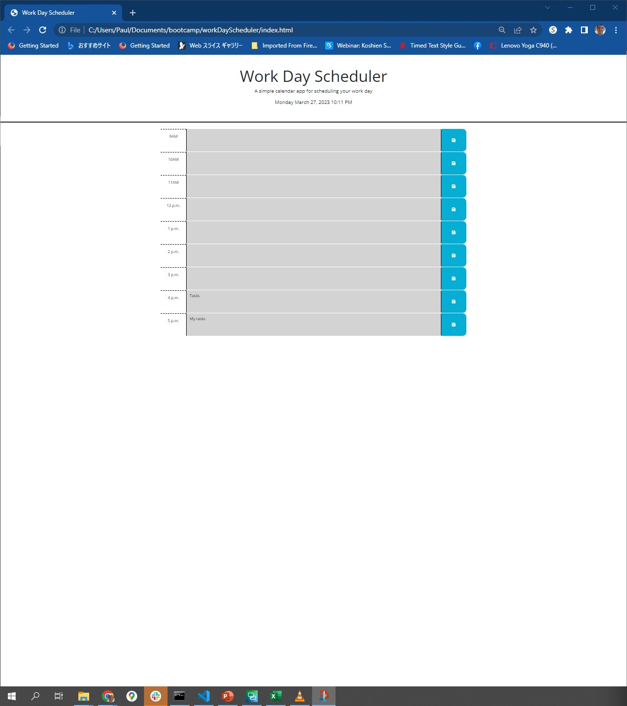

# Work Scheduler

## Description

An application that gives users the opportunity to enter events into individual time blocks from 9 a.m. to 5 p.m. and save those events into local storage. Time blocks are dynamically updated to show whether they are in the past, present, or future for that particular day.

## Location

The site is live at the following URL:
[https://pk50sshowa.github.io/workDayScheduler/index.html](https://pk50sshowa.github.io/pworkDayScheduler/index.html)

## Screenshots

## Developer Comments

Prompts for the password length and desired character sets are given through window alerts.
The generated password itself is also shown through a window alert is written to the main window.

## Contributing

Please take a look at the code history at this project's repo page:
[https://github.com/pk50sshowa/workDayScheduler/](https://github.com/pk50sshowa/workDayScheduler/)

## Support

Any questions can be directed to the developer at paul.koehler@gmail.com

## Credits

jQuery may be legacy code at this point, but I'm grateful to the people out there who helped walk me through some of the steps related to local storage, especially Meg Meyers!

## License

[MIT](https://choosealicense.com/licenses/mit/)